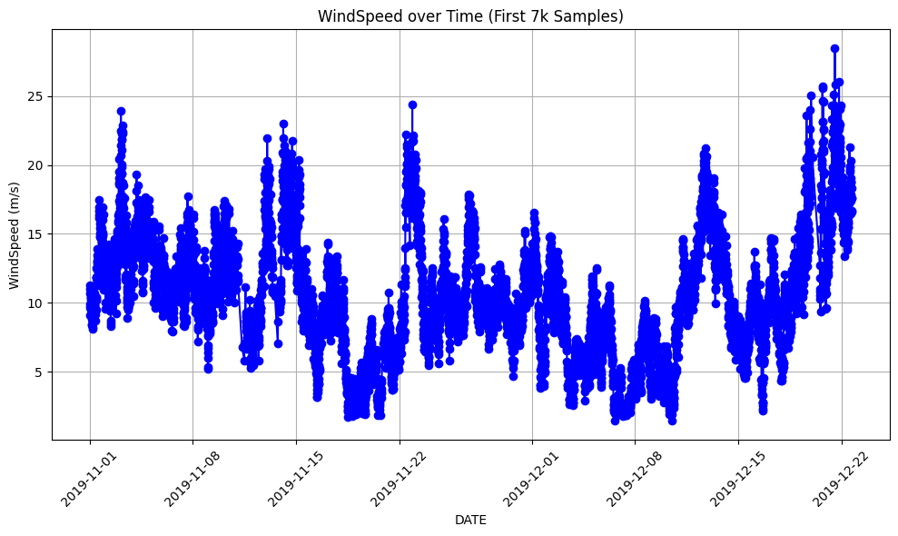

## Efficient Gap Filling in Wind Turbine Data Using LightGBM

In the era of renewable energy buzz, wind turbine data should be as predictable as a grandma's cookie recipe. 
But guess what? It’s not always like this. Time-series data plays hide-and-seek, and gaps are there to  crash the party.

This is where LightGBM comes into hand for efficient gap filling in time-series data.

This solution aims to enhance data completeness, ensuring a more accurate and robust analysis by addressing missing values in a systematic manner. 

LightGBM's efficiency in handling large datasets make it the ideal choice for this task, allowing for a seamless integration of machine learning into the gap-filling process.

Built upon the foundation of XGBoost, LightGBM stands as a formidable player in the realm of gradient boosting models. Sharing common roots, these models exhibit similarities in their approach to boosting decision trees.

Both XGBoost and LightGBM strive for excellence in terms of scalability, efficiency, and predictive performance!
### Background
Time-series data is basically a chronological sequence of observations. It holds the heartbeat of dynamic processes, making it a foundation in various domains. 

<!-- 

  

  

 --> 
<!-- 
 

 --> 
 

 

  

Its importance lies in capturing trends, patterns, and dependencies over time, offering a lens into evolving phenomena. However, analyzing time-series data comes with its set of challenges. The temporal dimension introduces complexities such as seasonality, trend variations, and the omnipresent issue of missing values.

### The Problem

Time-series wind turbine data also presents some challenges.  Wind turbine data often exhibits seasonal patterns, influenced by weather conditions and environmental factors.
  

Image 2: Decomposition of WindSpeed time-series: Original, trend, seasonal and residual.
If we look closely, by decreasing the size of the dataset, we can better inspect the seasonality of the data:
  

Image 3: Seasonal component of WindSpeed data.

Seasonal changes can lead to variations in wind patterns, affecting the performance of wind turbines. During certain seasons, the wind may be less consistent or more turbulent, resulting in gaps or missing values in the recorded data. These gaps can occur due to factors such as low wind speeds, maintenance activities, or sensor malfunctions during specific seasonal conditions.

Seasonal adjustments or operational changes made by turbine operators to optimize performance may introduce discontinuities in the data. For example, if operational adjustments are made during a particular season, there may be periods of missing data or data with different characteristics.

Gaps or missing values in the time-series data are common due to sensor malfunctions, maintenance, or other operational issues. Filling in these gaps accurately without introducing bias is a critical challenge for reliable analysis!

### The Solution 

Engineered for speed and scalability, LightGBM boasts a unique approach to tree-building that makes it particularly well-suited for time-series data. 

Having previously employed LightGBM for forecasting with exceptional outcomes, it became the natural choice when faced with the challenge of addressing data gaps. 

Its ability to handle large datasets and efficiently navigate the temporal intricacies of time-series information positions LightGBM as a powerful tool for tasks like gap filling in wind turbine data.

My approach involved addressing gaps in the data during as a forecasting task. For instance, when encountering a 2-hour gap in the dataset, I trained the model using the preceding data points and tasked it with predicting the missing data points within that gap. In essence, we are treating the problem as a multi-step forecasting task.

Additionally, since only one variable (WindSpeed) is employed in this approach, it is referred to as recursive multi-step forecasting.

However, the challenge lay in communicating to LightGBM the presence of specific gaps and enabling it to comprehend the number of missing data points. 

The missing data manifested in the form of absent rows. 

To address this, I implemented the following strategy: first, I detected gaps in the DATE column. Subsequently, I calculated the size of each gap, which in turn determined the forecast horizon (i.e., the number of data points to predict). Additionally, I computed the starting index of each gap, providing the model with the necessary information to initiate predictions from that particular data point. 

Of course, a lot of **data exploration** and pre-processing was performed. Getting intimate with the data is one the most important steps in any data science/machine learning project. Some pre-processing steps in this project included: outlier removal, understanding the statistical distribution of data, data validation and feature engineering (creating lag features).

This strategy proved to be highly effective in practice!

### Results and Validation 

Several procedures were adopted to make sure the best model would be created:
 - Hyperparameter Tuning of LightGBM
 - Cross-validation 
 - Lag Feature Tuning
 - Tweaking the train size 

It would be too much information to display here. So here I showcase some results regarding the lag feature tuning:
  

|          | MAE   | MSE   | MAPE  |
|----------|-------|-------|-------|
| Lag 2    | 0.685 | 0.653 | 4.116 |
| Lag 3    | 0.614 | 0.589 | 3.623 |
| Lag 4    | 0.792 | 0.880 | 4.808 |

  
And some plots for you:

 
Image 4: Results considering a lag feature of 2. 
  

  
Image 5: Results considering a lag feature of 3.
  

  
Image 6: Results considering a lag feature of 4.
  
#### Results

  
Image 7: Gap filling WindSpeed plot results.
  

   
Image 8: Gap filling WindSpeed plot results.

  
I also tested the code on other type of energy data, in this case in the total active energy data in several households:

  
Image 9: Total active energy data gap filling results.

### Pros and Cons

**Advantages:** All the advantages listed above regarding lightgbm (scalability, adaptability, robustness, simple hyperparameter tuning) ;). Plus, as we are tranining no neural network, the runtime is relatively very fast, as you can imagine. Besides, it is highly explainable :) . 

Given my strong interest in explainable AI, coupled with the development of a service for a client, a model like this proves highly valuable. Its transparency and interpretability in decision-making enable thorough result explanations, and it facilitates an examination of which features contribute most significantly to the outcomes.

**Limitations:** There is a distinct limitation to consider. In cases where the gap appears at the beginning of the dataset, for instance, before the 500th sample, the model's performance may be compromised. This is attributed to the fact that the model is trained using the entire dataset preceding the gap's index. Therefore, if a gap initiates at, let's say, index 300, the model is only trained with 299 data samples, resulting in suboptimal outcomes. Intriguingly, beyond the 500th index, the model consistently produces highly satisfactory results.

In my specific use case, this wasn't a significant concern, as I anticipated receiving datasets from the client with over 1000k+ rows. This substantial amount of data mitigated the impact of gaps occurring at the beginning of the dataset, allowing the model to be trained on a sufficiently large sample size and yielding satisfactory results.

The plot below illustrates the limitation I just mentioned. As observed, certain predictions on the date 2019-12-13 do not align with the temporal distribution of the surrounding data points. Notably, the model forecasts identical values across a span of 10+ data points. I am aware, based on the specifications of my use case, that such a pattern would not be representative of real-world data.

  

  
Image 9: Gap filling WindSpeed plot results.
  

### Deployment with Streamlit
I love Streamlit! It is so easy to use, to understand and to deploy. Its interactivity and the way it enhances the user experience is a game-changer for data exploration and data storytelling.

You can find my streamlit app [here](https://gapfilling.streamlit.app/).

Note: for this to work you need to have a dataset with the following column names: WT, ActivePower, WindSpeed and DATE.

Or you can use the default dataset to give it a try ;) 

On the left side, you can also tweak the hyperparameters of LightGBM to see how the results change based on these changes.

The app is a very simple and does not show any in-depth analysis on the data. Its purpose is mainly related to visualization and hyperparameter tweaking. 

Dive into the power of LightGBM for gap filling in wind turbine data! Explore the Streamlit app, tweak hyperparameters, and uncover the magic behind accurate predictions.

### Conclusion
The presented approach using LightGBM for gap filling in wind turbine time-series data proves to be a valuable solution. Leveraging LightGBM's scalability and effectiveness in handling large datasets, the model successfully addresses missing values, enhancing data completeness and contributing to more accurate and robust analyses.

Despite the demonstrated limitation in cases where gaps occur at the beginning of the dataset, the model exhibits promising performance beyond a certain index, showcasing its effectiveness in real-world scenarios with substantial datasets.

The adoption of LightGBM, being a transparent and interpretable model, aligns with the principles of explainable AI, providing insights into decision-making processes and feature contributions. The ease of deployment with Streamlit further enhances the user experience, allowing for interactive data exploration and hyperparameter tweaking.

It is essential to acknowledge its limitations, particularly when dealing with gaps at the dataset's outset. However, with careful consideration and ample data, the model proves to be a valuable asset in handling time-series data challenges.

Thanks a million for reading! :) 

###  References
[Time Series Forecasting with Supervised Machine Learning | by Unai López Ansoleaga | Towards Data Science](https://towardsdatascience.com/time-series-forecasting-with-machine-learning-b3072a5b44ba)

[Deep Learning, XGBoost Or Both: What Works Best For Tabular Data? (analyticsindiamag.com)](https://analyticsindiamag.com/deep-learning-xgboost-or-both-what-works-best-for-tabular-data/)

[Time Series Forecasting with LightGBM | Kaggle](https://www.kaggle.com/code/enesdilsiz/time-series-forecasting-with-lightgbm)

[Multi-step Time Series Forecasting with ARIMA, LightGBM, and Prophet | by Tomonori Masui |](https://towardsdatascience.com/multi-step-time-series-forecasting-with-arima-lightgbm-and-prophet-cc9e3f95dfb0) 

[Towards Data Science](https://towardsdatascience.com/multi-step-time-series-forecasting-with-arima-lightgbm-and-prophet-cc9e3f95dfb0)

[Recursive multi-step forecasting - Skforecast Docs (joaquinamatrodrigo.github.io)](https://joaquinamatrodrigo.github.io/skforecast/0.1/guides/autoregresive-forecaster.html)

