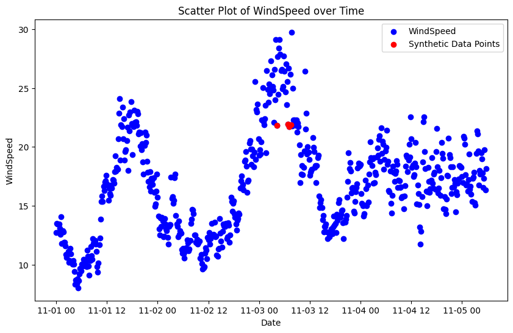
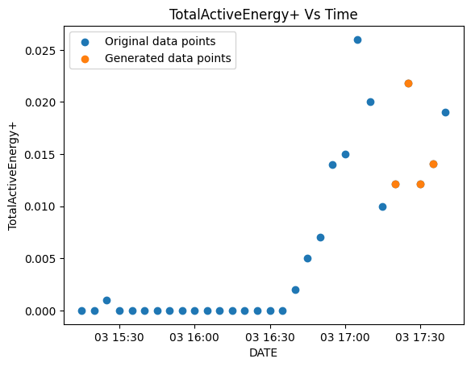

## Efficient Gap Filling in Wind Turbine Data Using LightGBM

In the era of renewable energy buzz, wind turbine data should be as predictable as a grandma's cookie recipe. 
But guess what? It’s not always like this. Time-series data plays hide-and-seek, and gaps are there to  crash the party.

This is where LightGBM comes into hand for efficient gap filling in time-series data.

This solution aims to enhance data completeness, ensuring a more accurate and robust analysis by addressing missing values in a systematic manner. 

LightGBM's efficiency in handling large datasets make it the ideal choice for this task, allowing for a seamless integration of machine learning into the gap-filling process.

Built upon the foundation of XGBoost, LightGBM stands as a formidable player in the realm of gradient boosting models. Sharing common roots, these models exhibit similarities in their approach to boosting decision trees.

Both XGBoost and LightGBM strive for excellence in terms of scalability, efficiency, and predictive performance!
### Background
Time-series data is basically a chronological sequence of observations. It holds the heartbeat of dynamic processes, making it a foundation in various domains. 

  
hello2
Its importance lies in capturing trends, patterns, and dependencies over time, offering a lens into evolving phenomena. However, analyzing time-series data comes with its set of challenges. The temporal dimension introduces complexities such as seasonality, trend variations, and the omnipresent issue of missing values.

### The Problem

Time-series wind turbine data also presents some challenges.  Wind turbine data often exhibits seasonal patterns, influenced by weather conditions and environmental factors.

If we look closely, by decreasing the size of the dataset, we can better inspect the seasonality of the data:

Seasonal changes can lead to variations in wind patterns, affecting the performance of wind turbines. During certain seasons, the wind may be less consistent or more turbulent, resulting in gaps or missing values in the recorded data. These gaps can occur due to factors such as low wind speeds, maintenance activities, or sensor malfunctions during specific seasonal conditions.

Seasonal adjustments or operational changes made by turbine operators to optimize performance may introduce discontinuities in the data. For example, if operational adjustments are made during a particular season, there may be periods of missing data or data with different characteristics.

Gaps or missing values in the time-series data are common due to sensor malfunctions, maintenance, or other operational issues. Filling in these gaps accurately without introducing bias is a critical challenge for reliable analysis!

### The Solution 

Engineered for speed and scalability, LightGBM boasts a unique approach to tree-building that makes it particularly well-suited for time-series data. Its ability to handle large datasets and efficiently navigate the temporal intricacies of time-series information positions LightGBM as a powerful tool for tasks like gap filling in wind turbine data.

My approach involved addressing gaps in the data during as a forecasting task. For instance, when encountering a 2-hour gap in the dataset, I trained the model using the preceding data points and tasked it with predicting the missing data points within that gap.

However, the challenge lay in communicating to LightGBM the presence of specific gaps and enabling it to comprehend the number of missing data points. 

The missing data manifested in the form of absent rows. 

To address this, I implemented the following strategy: first, I detected gaps in the DATE column. Subsequently, I calculated the size of each gap, which in turn determined the forecast horizon (i.e., the number of data points to predict). Additionally, I computed the starting index of each gap, providing the model with the necessary information to initiate predictions from that particular data point. 

This strategy proved to be highly effective in practice!

  

   

  

### Deployment with Streamlit
### Pros and Cons

  

### Results and Validation
### Conclusion

### Acknowledgments and References

